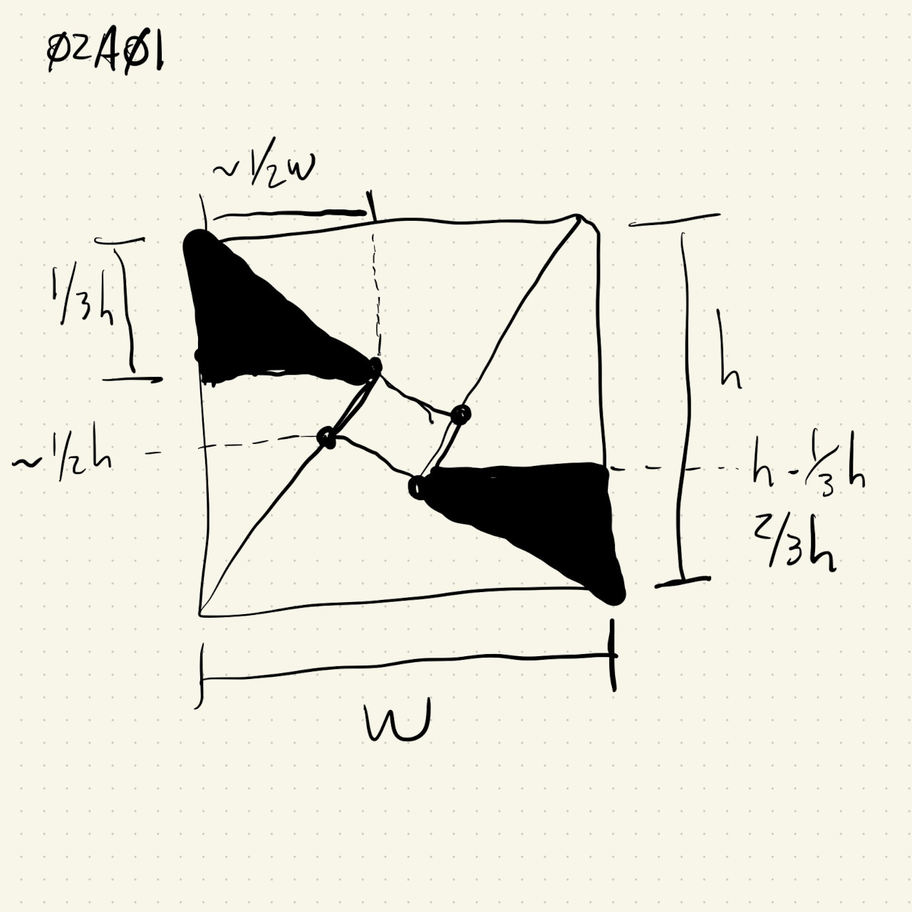
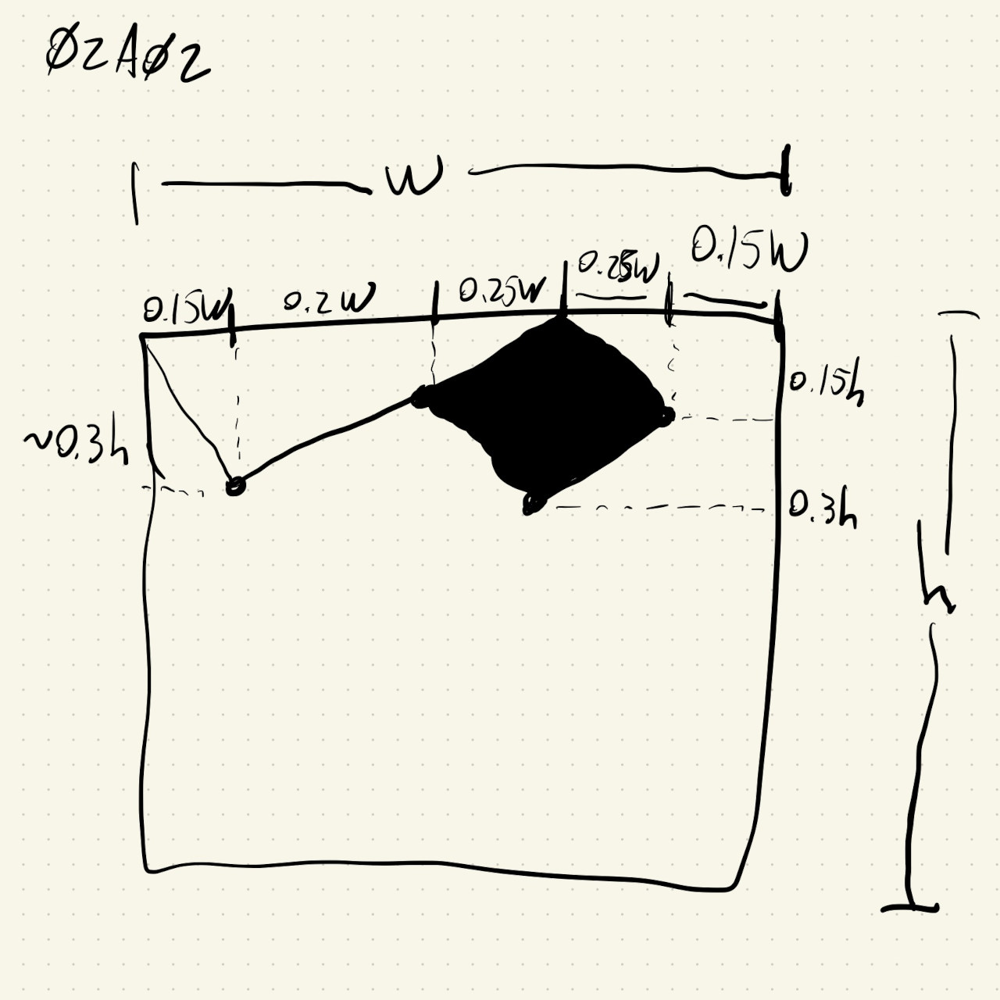
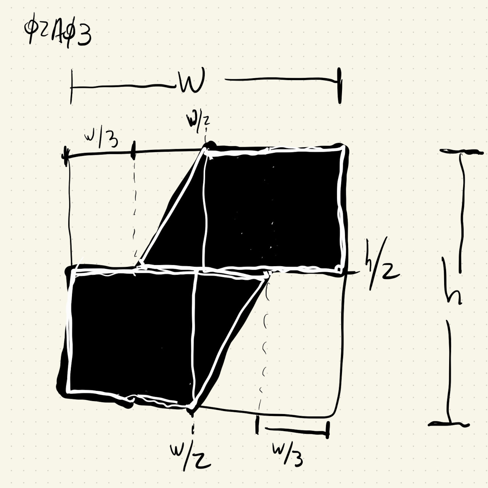

# HW02A

Recreation of three prints by Lygia Clark.

## HW02A01

This is made of 2 triangles, 2 lines and a quad for the rotated square. I estimated the triangles to be about 1/3 of the height of the painting, and their length was initially estimated to be about 1/2 of the painting width. I knew it wasn't 1/2, so the exact location of those points was determined later in the code.

## HW02A02

This was the hardest for me. I saved the image and used photoshop to get some rough estimates of the points marked in my drawing below. In the end I used 2 quads and 4 lines. Since the top and bottom of the painting are mirrored versions of each other, any point (X,Y) used in the top part corresponds to point (W-X, H-Y) in the bottom part, where W,H are the width and height of the painting.

## HW02A03

This was the most fun because there were no quads and all the points could be estimated by just looking at the original image. I initially drew it using 2 rectangles and 4 triangles, but noticed a simpler way to do it just involved 2 rectangles and 2 triangles. Like in the other paintings, the top and bottom parts are the same, but mirrored over the line Y = X, so any point (X,Y) in the top part has a corresponding (W-X, H-Y) in the bottom part.

